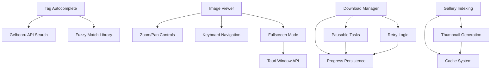

# Feature Landscape: Image Viewer & Gallery Indexing

**Domain:** Desktop Image Gallery Application (Tauri + Vue 3)
**Researched:** 2026-05-12
**Confidence:** MEDIUM-HIGH (based on existing codebase analysis + industry patterns)

---

## Table of Contents

1. [Full-Screen Image Viewer](#1-full-screen-image-viewer)
2. [Tag Autocomplete with Suggestions](#2-tag-autocomplete-with-suggestions)
3. [Download Pause/Resume/Retry](#3-download-pauseresumeretry)
4. [Gallery Index with Thumbnail Pre-generation](#4-gallery-index-with-thumbnail-pre-generation)

---

## 1. Full-Screen Image Viewer

**Complexity:** Medium-High

### Feature Breakdown

| Feature | Why Expected | Complexity | Dependencies |
|---------|--------------|-------------|---------------|
| Zoom controls | View details in high-res images | Medium | Mouse wheel handler, transform state |
| Pan/move image | Navigate zoomed images | Medium | Drag state, pointer events |
| Keyboard navigation | Arrow keys for prev/next | Low | Keyboard event listeners |
| Fullscreen mode | Immersive viewing | Medium | Browser Fullscreen API / Tauri window |
| Filmstrip/preview | Quick navigation to nearby images | High | Thumbnail strip component |
| Image info overlay | Show metadata, tags | Low | Existing tag system |
| Reset zoom | Return to fit-to-screen | Low | Zoom state management |

### Current Implementation State

**Already exists (basic):**
- Preview modal in `Home.vue` with prev/next navigation
- Arrow key navigation (`handleKeydown`)
- Escape to close
- Image info sidebar with tags

**Gaps vs. Table Stakes:**
- No zoom capability (images display at max-width 100%)
- No pan when zoomed
- No fullscreen mode
- No filmstrip/thumbnail navigation
- No fit/fill/actual size modes

### Recommended Approach

```typescript
// Zoom state management
interface ViewerState {
  scale: number;        // 1.0 = fit, 2.0 = 200%
  offsetX: number;      // pan offset
  offsetY: number;
  rotation: number;    // 0, 90, 180, 270
  mode: 'fit' | 'fill' | 'actual';
}

// Keyboard shortcuts
const SHORTCUTS = {
  'ArrowLeft': 'prev',
  'ArrowRight': 'next',
  'Escape': 'close',
  '+': 'zoomIn',
  '-': 'zoomOut',
  '0': 'resetZoom',
  'f': 'toggleFullscreen',
  'ArrowUp': 'panUp',
  'ArrowDown': 'panDown',
};
```

### Component Design

```
ImageViewer.vue (orchestrator)
├── ZoomableImage.vue (handles zoom/pan)
├── ViewerToolbar.vue (zoom controls, rotation, fullscreen)
├── ViewerFilmstrip.vue (horizontal thumbnail strip)
└── ViewerInfoPanel.vue (existing sidebar adapted)
```

### Complexity Notes

- **Zoom/Pan:** Requires CSS transform with hardware acceleration (`will-change: transform`)
- **Fullscreen:** Tauri window mode or HTML5 Fullscreen API
- **Filmstrip:** Lazy-load thumbnails, virtualized list for large galleries
- **Performance:** Debounce zoom gestures, use `requestAnimationFrame` for smooth panning

---

## 2. Tag Autocomplete with Suggestions

**Complexity:** Medium

### Feature Breakdown

| Feature | Why Expected | Complexity | Dependencies |
|---------|--------------|-------------|---------------|
| Live suggestions | Help users find correct tag names | Medium | Debounced API calls |
| Fuzzy matching | Handle typos, partial matches | Medium | Fuzzy search library |
| Recent tags | Quick access to frequently used | Low | Local storage / Pinia |
| Tag type grouping | Artists, characters, copyrights | Low | Existing tag type system |
| Keyboard selection | Arrow + Enter to select | Low | Focus management |

### Current Implementation State

**Already exists:**
- Search input in `Home.vue` (`searchInput`)
- Tag display with type colors (`tagTypeConfig`)
- Cascader for favorite tags (copyright -> character hierarchy)

**Gaps vs. Table Stakes:**
- No autocomplete with live suggestions
- No fuzzy matching
- No recent/frequently used tags
- No Gelbooru tag API search during typing

### Recommended Approach

```typescript
// Autocomplete store
interface AutocompleteState {
  query: string;
  suggestions: GelbooruTag[];
  selectedIndex: number;
  loading: boolean;
}

// Gelbooru tag search via existing scraper
// Endpoint: /index.php?page=tag&s=案&q={query}
```

### Component Design

```typescript
// TagInput.vue
interface Props {
  modelValue: string[];
  placeholder?: string;
}

// Features:
// - Multi-tag input (chip display)
// - Autocomplete dropdown on typing
// - Arrow key navigation in dropdown
// - Enter to select, Backspace to remove last tag
```

### Complexity Notes

- **Fuzzy matching:** Use `fuse.js` or `match-sorter` (lightweight, <10kb)
- **Debouncing:** 300ms delay before API call
- **Rate limiting:** Reuse existing HTTP client with delays
- **Cache recent queries:** LRU cache of recent searches

---

## 3. Download Pause/Resume/Retry

**Complexity:** Medium-High

### Feature Breakdown

| Feature | Why Expected | Complexity | Dependencies |
|---------|--------------|-------------|---------------|
| Pause button | User-initiated stop | Low | Existing `pause_download` |
| Resume button | Continue paused download | Low | Existing `resume_download` |
| Auto-retry on failure | Network resilience | Medium | Existing retry logic (partial) |
| Retry button | Manual retry for failed | Low | UI button + handler |
| Progress persistence | Resume after app restart | Medium | DB already stores progress |
| Queue management | Pause all / resume all | Low | Existing batch operations |

### Current Implementation State

**Already exists:**
- `DownloadStatus::Paused` state and handlers
- `pause_download` / `resume_download` commands
- Task persistence to SQLite
- Exponential backoff retry (3 attempts, 1s/2s/4s)
- Batch operations (`pauseAllDownloading`, `startAllPending`)

**Gaps vs. Table Stakes:**
- No retry button for failed tasks in UI
- Resume from saved progress (partial file handling) - partially implemented but needs verification
- No manual retry with different settings

### Download Task State Machine

```
                    ┌─────────────┐
                    │   PENDING   │
                    └──────┬──────┘
                           │ start_download()
                           ▼
                    ┌─────────────┐
           ┌───────►│ DOWNLOADING│◄──────────┐
           │        └──────┬──────┘            │
           │               │                   │
           │         pause_rx                  │ resume_download()
           │               │                   │
           │               ▼                   │
           │        ┌─────────────┐            │
           │        │   PAUSED    │────────────┘
           │        └─────────────┘
           │
           │               │ error / cancel
           │               ▼
           │        ┌─────────────┐
           │        │   FAILED    │
           │        └──────┬──────┘
           │               │ retry()
           │               ▼
           │        ┌─────────────┐
           │        │   PENDING   │ (re-queues)
           │        └─────────────┘
           │
           │               │ complete
           │               ▼
           │        ┌─────────────┐
           └───────│  COMPLETED  │
                   └─────────────┘

    CANCELLED ◄──── cancel()
```

### Recommended UI Elements

```typescript
// Download task card states
interface TaskCardState {
  status: DownloadTask['status'];
  progress: number;
  canPause: boolean;   // status === 'downloading'
  canResume: boolean;  // status === 'paused'
  canRetry: boolean;    // status === 'failed'
  canCancel: boolean;   // status !== 'completed' && status !== 'cancelled'
}
```

### Complexity Notes

- **Partial file resume:** Requires Range header support, which Gelbooru may not support
- **Background processing:** Downloads continue when app is minimized (Tauri handles this)
- **Progress accuracy:** Display MB downloaded / total MB

---

## 4. Gallery Index with Thumbnail Pre-generation

**Complexity:** High

### Feature Breakdown

| Feature | Why Expected | Complexity | Dependencies |
|---------|--------------|-------------|---------------|
| Thumbnail generation | Fast gallery browsing | High | Image processing library |
| Thumbnail caching | Avoid regeneration | Medium | File-based cache |
| Background processing | Non-blocking generation | High | Worker threads / tokio tasks |
| Index metadata | Store dimensions, dates | Medium | SQLite or JSON index |
| Incremental updates | New images get thumbnails | Medium | File watcher or on-demand |
| Progress indication | Show generation status | Medium | UI component |

### Current Implementation State

**Already exists:**
- Gallery view with masonry layout
- Image loading from local filesystem
- `convertFileSrc()` for local file URLs
- Directory scanning with parallel processing
- Breadcrumb navigation

**Gaps vs. Table Stakes:**
- No thumbnail generation (uses original images)
- No thumbnail cache
- Slow initial load for large directories
- No metadata index for sorting/filtering

### Recommended Architecture

```rust
// Backend: ThumbnailGenerator
pub struct ThumbnailGenerator {
    cache_dir: PathBuf,
    max_workers: usize,
    quality: u8,         // 60-80 for thumbnails
    sizes: Vec<(u32, u32)>,  // [(150, 150), (300, 300)]
}

// Cache structure
// {cache_dir}/{sha256_path}/{size}.jpg

// Commands
#[tauri::command]
async fn generate_thumbnail(
    image_path: String,
    size: (u32, u32),
) -> Result<String, String>  // Returns cached path

#[tauri::command]
async fn batch_generate_thumbnails(
    paths: Vec<String>,
    size: (u32, u32),
) -> Result<BatchProgress, String>
```

### Frontend Integration

```typescript
// Thumbnail loading with fallback
const thumbnailSrc = computed(() => {
  const cached = thumbnailCache.get(imagePath);
  if (cached) return convertFileSrc(cached);
  // Fallback to original or placeholder
  return convertFileSrc(originalPath);
});
```

### Complexity Notes

- **Image processing in Rust:** Use `image` crate with `tokio` for async processing
- **Memory management:** Limit concurrent thumbnail operations
- **Cache invalidation:** Monitor source file mtime
- **Disk space:** Periodic cleanup of orphaned thumbnails

---

## Feature Dependencies



---

## MVP Recommendation

### Phase 1: Essential Viewer (Priority 1)

**Prioritize:**
1. Add zoom controls to existing preview modal
2. Add pan when zoomed
3. Add fit/fill/actual size mode toggle

**Why:** Users immediately want to inspect downloaded images in detail.

### Phase 2: Tag Autocomplete (Priority 2)

**Prioritize:**
1. Basic autocomplete with debounced API calls
2. Keyboard selection (arrows + Enter)
3. Recent tags (last 20 used)

**Why:** Improves search UX significantly with moderate effort.

### Phase 3: Download Retry UI (Priority 3)

**Prioritize:**
1. Add retry button for failed tasks
2. Show error message in UI
3. Auto-retry toggle in settings

**Why:** Backend already supports retry; just needs UI.

### Phase 4: Gallery Thumbnails (Priority 4)

**Prioritize:**
1. Backend thumbnail generation with `image` crate
2. File-based cache system
3. Background processing queue

**Why:** Most complex, do after other features are stable.

### Defer

- Filmstrip navigation (Phase 5)
- Fullscreen mode (Phase 5)
- Incremental thumbnail updates with file watcher (Phase 6)

---

## Anti-Features

| Anti-Feature | Why Avoid | What to Do Instead |
|--------------|-----------|-------------------|
| Built-in image editing | Scope creep, complex | Let users open in external editor |
| Cloud sync | Privacy concerns, complexity | Local-first design |
| Social sharing | Not relevant to this domain | Focus on browsing/downloading |
| Automatic tagging AI | Unnecessary for curated content | Manual tagging works fine |

---

## Sources

- **Context:** Existing codebase analysis (`Gallery.vue`, `Home.vue`, `download.rs`)
- **Patterns:** Industry-standard image viewer patterns (zoom, pan, keyboard nav)
- **Confidence:** MEDIUM-HIGH - Based on existing implementation patterns and standard Vue/Tauri approaches
